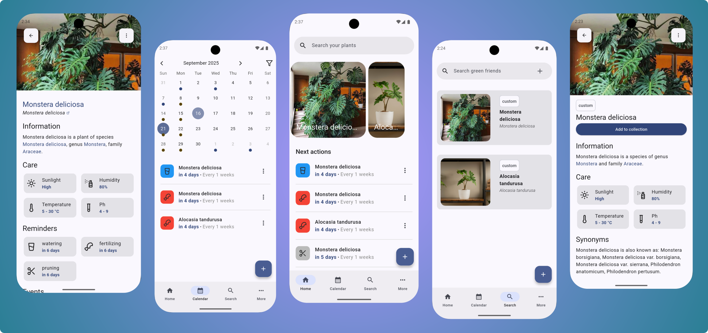

    

        
    

 

Plant-it is a <b>gardening companion app.</b> Useful for keeping track of plant care, receiving notifications about when to water plants, uploading plant images, and more.

<a href="https://github.com/MDeLuise/plant-it/#why">Why?</a> • <a href="https://github.com/MDeLuise/plant-it/#features-highlight">Features highlights</a> • <a href="https://github.com/MDeLuise/plant-it/#download">Download</a> • <a href="https://github.com/MDeLuise/plant-it/#support-the-project">Support</a> • <a href="https://github.com/MDeLuise/plant-it/#contribute">Contribute</a>

  

## Why?
Plant-it is a gardening companion app that helps you take care of your plants.

It does not recommend you about which action to take; instead, it is designed to log the activity you are doing. This is on purpose, as I strongly believe that the only one in charge of knowing when to water your plants, when to fertilize them, etc., is you (with the help of multiple online sources).

Plant-it helps you remember the last time you did a treatment of your plants, which plants you have, collects photos of your plants, and notifies you about the time passed since the last action on them.

## Features highlight
* Add existing plants or user-created plants to your collection
* Log events like watering, fertilizing, biostimulating, etc. for your plants
* View all the logged events, filtering by plant and event type
* Upload photos of your plants
* Set reminders for some actions on your plants (e.g., notify if not watered every 4 days)

## Download
You can download the Plant-it Android app from the following sources:

- **GitHub Releases**: You can download the latest APK from the [GitHub releases page](https://github.com/MDeLuise/plant-it/releases/latest).
  

    
  

- **F-Droid**: Alternatively, you can get the app from [F-Droid](https://f-droid.org/packages/com.github.mdeluise.plantit/).
  

    
  

- **Obtanium**: You can also download the app from [Obtanium](http://apps.obtainium.imranr.dev/redirect.html?r=obtainium://add/https://github.com/MDeLuise/plant-it).
  

      
    

> **Note on iOS and Play Store Availability:**  
> Currently, there is no iOS version of the app, nor is it available on the Play Store. This decision is based on my preference not to pay for publishing a free app, as well as concerns about privacy. I aim to minimize sharing personal data, such as my address, with large corporations like Google or Apple. Therefore, the app is currently exclusively available for Android users through the alternative sources mentioned above.

## Support the project
If you find this project helpful and would like to support it, consider [buying me a coffee](https://www.buymeacoffee.com/mdeluise). Your generosity helps keep this project alive and ensures its continued development and improvement.

  

## Contribute

We welcome contributions to help improve the Plant-it project! Whether you want to fix bugs, add new features, or enhance documentation, your input is valuable. 

Please refer to the [Contributing Guidelines](contributing.md) for detailed instructions on how to contribute effectively. Thank you for your support!

### Translations

Translations status via weblate:

...
