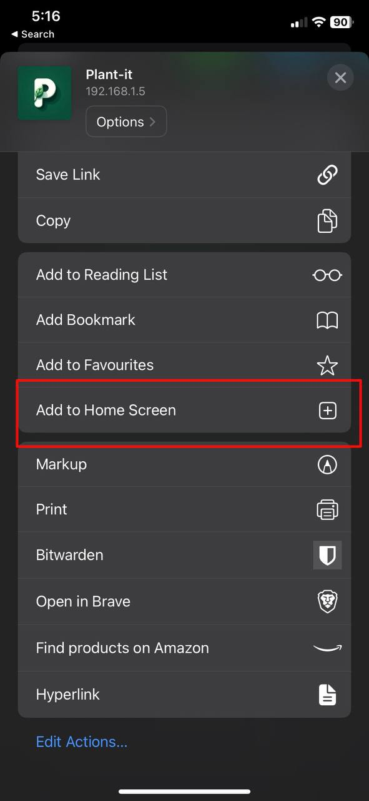

# App Installation

To illustrate how to use the various components of this project, let's assume you have deployed the server Docker image on a machine with the IP address `192.168.1.5` and have kept the default port configurations. Specifically, the API is running on port `8080`, and the frontend is running on port `3000`.

The sections below will guide you on how to use the app via different platforms. By following the steps in each section, you will be able to effectively use the system on various platforms.

## Web App
To access the web application, follow these steps:

1. Open your web browser and navigate to `http://192.168.1.5:3000`.
2. You will see a page like the following:

   { align=left; loading=lazy; style="height:600px;"}
   { align=left; loading=lazy; style="height:600px;"}

3. In the server URL field, enter `http://192.168.1.5:8080` and click on "Continue".

You can now either log in if you already have an account or sign up to create a new one. Once logged in, you can start using the app.

## Android
For Android devices, you have two options to use the app:

### Web App
1. Open your preferred browser on your Android device.
2. Navigate to `http://192.168.1.5:3000` and follow the same steps as described in the Web App section.

### APK
Alternatively, you can use the native Android application by installing the APK file:

1. Download the APK file from the [GitHub releases assets](https://github.com/MDeLuise/plant-it/releases/latest) or [FDroid](https://f-droid.org/en/packages/com.github.mdeluise.plantit/).
2. Install the APK on your device (ensure you have enabled installation from unknown sources in your settings).
3. Open the app and follow the instructions to set up and start using it.

## iOS
Currently, the native iOS application is not available. However, you can use the web app on your iOS device by following these steps:

1. Open Safari and navigate to `http://192.168.1.5:3000`.
2. You will see a page like the following:
   
   { align=left; loading=lazy; style="height:600px;"}
   { align=left; loading=lazy; style="height:600px;"}

3. Tap the share button in the navigation bar.
4. Scroll down and tap on "Add to Home Screen".
5. The web app will now be installed on your device as a PWA (Progressive Web App).
6. Open the newly installed app and follow the steps in the Web App section to start using it.

## REST API
For direct interaction with the server via the REST API:

1. Open your browser and navigate to the Swagger UI available at `http://192.168.1.5:8080/api/swagger-ui/index.html`.

The Swagger UI provides a comprehensive interface to interact with the API endpoints.
Here, you can perform all main operations supported by the API, including authentication, data retrieval, and data manipulation.
