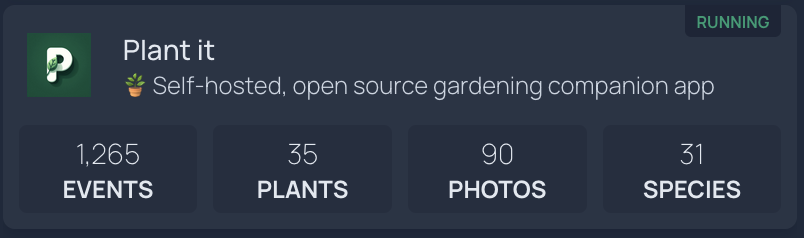

# Server Installation

## Prerequisite
Before installing Plant-it, make sure you have the following prerequisites:

* `docker` version 3 or above
* `docker-compose`

## Quickstart
Installing Plant-it is pretty straight forward, in order to do so follow these steps:

* Create a folder where you want to place all Plant-it related files.
* Inside that folder, create a file named `docker-compose.yml` with this content:
```yaml
name: plant-it
services:
  server:
    image: msdeluise/plant-it-server:latest
    env_file: server.env
    depends_on:
      - db
      - cache
    restart: unless-stopped
    volumes:
      - "./upload-dir:/upload-dir"
    ports:
      - "8080:8080"
      - "3000:3000"

  db:
    image: mysql:8.0
    restart: always
    env_file: server.env
    volumes:
      - "./db:/var/lib/mysql"

  cache:
    image: redis:7.2.1
    restart: always
```

* Inside that folder, create a file named `server.env` with this content:
```properties
#
# DB
#
MYSQL_HOST=db
MYSQL_PORT=3306
MYSQL_USERNAME=root
MYSQL_PSW=root
MYSQL_DATABASE=bootdb
MYSQL_ROOT_PASSWORD=root

#
# JWT
#
JWT_SECRET=putTheSecretHere
JWT_EXP=1

#
# Server config
#
USERS_LIMIT=-1
UPLOAD_DIR=/upload-dir
API_PORT=8080
FLORACODEX_KEY=
LOG_LEVEL=DEBUG
ALLOWED_ORIGINS=*

#
# Cache
#
CACHE_TTL=86400
CACHE_HOST=cache
CACHE_PORT=6379
```

* Run the docker compose file (`docker compose -f docker-compose.yml up -d`), then the service will be available at `localhost:3000`, while the REST API will be available at `localhost:8080/api` (`localhost:8080/api/swagger-ui/index.html` for the documentation of them).

## Configuration
The `server.env` file is used to pass configurations to the server. An example of properties and descriptions is the following:
```properties
#
# DB
#
MYSQL_HOST=db
MYSQL_PORT=3306
MYSQL_USERNAME=root
MYSQL_PSW=root
MYSQL_DATABASE=bootdb
MYSQL_ROOT_PASSWORD=root

#
# JWT
#
JWT_SECRET=putTheSecretHere
JWT_EXP=1

#
# Server config
#
USERS_LIMIT=-1 # less then 0 means no limit
UPLOAD_DIR=/upload-dir # path to the directory used to store uploaded images, if on docker deployment leave as it is and change the volume binding in the docker-compose file if needed
API_PORT=8080
FLORACODEX_URL=https://api.floracodex.com
FLORACODEX_KEY=
ALLOWED_ORIGINS=* # CORS allowed origins (comma separated list)
LOG_LEVEL=DEBUG # could be: DEBUG, INFO, WARN, ERROR
CONTACT_MAIL=foo@bar.com # address used as "contact" for template email
REMINDER_NOTIFY_CHECK=0 30 7 * * * # 6-values crontab expression to set the check time for reminders
MAX_REQUESTS_PER_MINUTE=100 # rate limiting of the upcoming requests

#
# Notification
#
NTFY_ENABLED=true # if "false" ntfy service won't be available as notification dispatcher
GOTIFY_ENABLED=true # if "false" ntfy service won't be available as notification dispatcher

#
# Cache
#
CACHE_TYPE=redis # Cache type. By default, it's "redis" but can also be "none"
CACHE_TTL=86400
CACHE_HOST=cache
CACHE_PORT=6379
CACHE_PASSWORD=
CACHE_USERNAME=

#
# SMTP
#
SMTP_HOST=
SMTP_PORT=
SMTP_EMAIL=
SMTP_PASSWORD=
SMTP_AUTH=
SMTP_START_TTL=
```

### Integration with Trefle Service [NOT WORKING ANYMORE]
!!! warning end "Trefle Service Inactivity"

    The Trefle service, which Plant-it relied on for plant data, appears to be inactive. There have been no updates to their database, and their repository shows no recent activity, with several open issues dating back years. While the dataset was accessible until recently, it is no longer available.

    I am currently exploring the best way to move forward and working on a replacement for this service, as mentioned in [issue #218](https://github.com/MDeLuise/plant-it/issues/218).

    As a temporary solution, the Flora Codex service has replaced the Trefle service. However, it lacks some features such as:

      •	Plant care information
      •	Synonyms

    Additionally, it has fewer plants compared to Trefle.

    This is a temporary patch that will be resolved in the near future.


### Integration with FloraCodex
To enhance your application with plant search capabilities, you can integrate with the FloraCodex service. FloraCodex provides a comprehensive API for searching and retrieving plant information. Follow the steps below to configure and use the FloraCodex service in your project:

1. **Create an Account on FloraCodex:**
   
    - Visit the [FloraCodex website](https://floracodex.com/) and sign up for an account.
    - Follow the registration process to verify your account.

2. **Retrieve the API Key:**
   
    - Once your account is set up, log in to your FloraCodex account.
    - Navigate to the API section to generate or retrieve your API key. This key is necessary for authenticating your requests to the FloraCodex API.

3. **Configure the API Key:**
   
    - Open the `server.env` file in your project.
    - Add the following line to the file, replacing `YOUR_FLORACODEX_API_KEY` with the actual API key you obtained from FloraCodex: `FLORACODEX_KEY=YOUR_FLORACODEX_API_KEY`

4. **Save and Restart Your Server:**
   
    - Save the changes made to the `server.env` file.
    - Restart your server to apply the new configuration.

By following these steps, you enable your application to use the FloraCodex service for searching and retrieving information about existing plants. Ensure that your API key is kept secure and not exposed publicly to avoid unauthorized access.

### Deployment Without Cache
If you need to deploy the application without using a cache, you can disable the cache by setting the `CACHE_TYPE` environment variable to `none`. This prevents the application from attempting to connect to a cache service.

Then, to remove the cache service from your deployment, update your docker-compose.yaml file as follows:
```yaml
name: plant-it
services:
  server:
    image: msdeluise/plant-it-server:latest
    env_file: server.env
    depends_on:
      - db
    restart: unless-stopped
    volumes:
      - "./upload-dir:/upload-dir"
    ports:
      - "8080:8080"
      - "3000:3000"

  db:
    image: mysql:8.0
    restart: always
    env_file: server.env
    volumes:
      - "./db:/var/lib/mysql"
```

### Deployment Without Docker
If you prefer to install and run the server without using Docker, ensure that you have Java Runtime Environment (JRE) 21 installed on your system. Follow these steps to set up the server:

1. **Download the Server JAR File**:
   
    - Obtain the `server.jar` file from the [latest release of the project on GitHub](https://github.com/MDeLuise/plant-it/releases/latest).

2. **Set Environment Variables**:
   
    - You can configure the necessary environment variables in two ways:
     
        - **Option 1**: Manually export them in your terminal based on your setup. For example:
          ```bash
          export MYSQL_HOST=localhost && \
          export MYSQL_PORT=3306 && \
          ...
          ```
        Adjust these variables according to your specific setup.
     
        - **Option 2**: Provide a `server.properties` file that contains all the required properties. You can download a template for this file from the [project's repository](https://github.com/MDeLuise/plant-it/blob/main/backend/src/main/resources/application.properties) and adjust it to suit your configuration.
   
3. **Run the Server**:
   
    - If you chose **Option 1** (manually setting environment variables), run the server using the following command:
      ```bash
      java -jar server.jar
      ```
    - If you chose **Option 2** (using the `server.properties` file), run the server with the following command, specifying the location of your configuration file:
      ```bash
      java -jar server.jar --spring.config.location=classpath:/<path-to-server.properties>
      ```

#### **Frontend Setup Without Docker**
For the frontend, if you're using Android, you can use the provided APK available on [GitHub releases](https://github.com/MDeLuise/plant-it/releases/latest) or [F-Droid](https://f-droid.org/packages/com.github.mdeluise.plantit/). However, for iOS, a standalone app is not available. If you choose not to use Docker for the frontend, follow these steps:

1. **Download the Frontend Files**:
   
    - Download the `client.tar.gz` file from the [latest release of the project on GitHub](https://github.com/MDeLuise/plant-it/releases/latest).

2. **Uncompress the Files**:
   
    - Extract the contents of the `client.tar.gz` file:
      ```bash
      tar -xzf client.tar.gz
      ```

3. **Serve the Files**:
   
    - You can serve the frontend files locally using a simple HTTP server. For example, using Python:
      ```bash
      python3 -m http.server 3000
      ```
   - Alternatively, you can serve the files using a web server like Nginx.

By following these instructions, you can deploy both the server and frontend components without relying on Docker. This setup provides flexibility if Docker is not available or desirable in your environment.


## Change ports binding
### Backend
If you don't want to use the default port `8080`, you can do the following:

* change the port binding in the `docker-compose.yml` file, e.g. `9090:8080` to setup the port `9090` for the backend service,

### Frontend
If you don't want to use the default port `3000`, you can do the following:

* change the port binding in the `docker-compose.yml` file, e.g. `4040:3000` to setup the port `4040` for the frontend service

### Complete example
Let's say that you want to run Plant-it on a server with IP `http://192.168.1.103` and want to have:

* the backend on port `8089`,
* the frontend on port `3009`.

Then this will be you configuration for the `docker-compose.yml` file:
```yaml
name: plant-it
services:
  server:
    image: msdeluise/plant-it-server:latest
    env_file: server.env
    depends_on:
      - db
      - cache
    restart: unless-stopped
    volumes:
      - "./upload-dir:/upload-dir"
    ports:
      - "8089:8080"
      - "3009:3000"
  db:
    image: mysql:8.0
    restart: always
    env_file: server.env
    volumes:
      - "./db:/var/lib/mysql"
  cache:
    image: redis:7.2.1
    restart: always
```
And this will be you configuration for the `server.env` file:
```properties
#
# DB
#
MYSQL_HOST=db
MYSQL_PORT=3306
MYSQL_USERNAME=root
MYSQL_PSW=root
MYSQL_DATABASE=bootdb
MYSQL_ROOT_PASSWORD=root

#
# JWT
#
JWT_SECRET=32characterscomplicatedsecret
JWT_EXP=1

#
# Server config
#
USERS_LIMIT=2
UPLOAD_DIR=/upload-dir
API_PORT=8080
FLORACODEX_KEY=
ALLOWED_ORIGINS=*

#
# Cache
#
CACHE_TTL=86400
CACHE_HOST=cache
CACHE_PORT=6379
```

## Example of traefik deployment
This is an example of deployment using [traefik](https://traefik.io/traefik/):
```
version: '3'
services:
  reverse-proxy:
    image: traefik:v3.0
    command: --api.insecure=true --providers.docker
    ports:
      - "80:80"
      - "8080:8080"
    volumes:
      - /var/run/docker.sock:/var/run/docker.sock

  server:
    image: msdeluise/plant-it-server:latest
    env_file: server.env
    depends_on:
      - db
      - cache
    restart: unless-stopped
    labels:
      - "traefik.enable=true"
      - "traefik.http.routers.app.rule=Host(`plant-it.docker.localhost`)"
      - "traefik.http.routers.app.service=server"
      - "traefik.http.routers.app.entrypoints=http"
      - "traefik.http.services.server.loadbalancer.server.port=3000"
      
      - "traefik.http.routers.api.rule=Host(`plant-it-api.docker.localhost`)"
      - "traefik.http.routers.api.service=server-api"
      - "traefik.http.routers.api.entrypoints=http"
      - "traefik.http.services.server-api.loadbalancer.server.port=8080"

  db:
    image: mysql:8.0
    restart: always
    env_file: server.env
    volumes:
      - "./db:/var/lib/mysql"
    labels:
      - "traefik.enable=false"

  cache:
    image: redis:7.2.1
    restart: always
    labels:
      - "traefik.enable=false"
```

Visit `http://plant-it.docker.localhost` for accessing the app, and `http://plant-it-api.docker.localhost/api/swagger-ui/index.html` for accessing the Swagger UI.
Use `http://plant-it-api.docker.localhost` as server URL when request in the app setup.

## SMTP Configuration for Email Notifications
An SMTP server can be used to send notifications to users, such as password reset emails. To configure the usage of an SMTP server, the following properties need to be set in the `server.env` file:

- **SMTP_HOST**: The host of the SMTP server.
- **SMTP_PORT**: The port of the SMTP server.
- **SMTP_EMAIL**: The email address used to send notifications.
- **SMTP_PASSWORD**: The password of the email account used for authentication.
- **SMTP_AUTH**: This parameter enables or disables authentication for the SMTP server.
- **SMTP_START_TLS**: This parameter enables or disables the use of STARTTLS for secure communication with the SMTP server.
- **CONTACT_MAIL**: contact address to use in the email templates if a user want to contact the administrator

!!! info "Email credentials"

    Please note that some providers, such as Gmail, may require the use of an [application-specific password](https://support.google.com/mail/answer/185833?hl=en) for authentication.

### Example Gmail Configuration
```properties
SMTP_HOST=smtp.gmail.com
SMTP_PORT=587
SMTP_EMAIL=your-email@gmail.com
SMTP_PASSWORD=your-application-password
SMTP_AUTH=true
SMTP_START_TTL=true
CONTACT_MAIL=your-email@gmail.com
```

## Homepage dashboard integration
<p align="center">

</p>
The project offers a widget for integrates the service with the popular dashboard called [homepage](https://github.com/gethomepage/homepage).
In order to use it, simply place the widget as above in the configuration yml file of the dashboard:
```
- Plant-it:
    href: <server-app-url>
    description: 🪴 Self-hosted, open source gardening companion app
    icon: plant-it
    widget:
      type: plantit
      url: <server-backend-url>
      key: <you-key>
```
You can get the API Key following the step in the relative section.

## API Key Retrieval
To retrieve an API Key using the REST API, follow these steps:

1. **Authenticate and Retrieve JWT Token:**
   
    - Send a `POST` request to the authentication endpoint to log in.
    - Replace `<server-url>` with the actual server URL.
    - Example using `curl`:

      ```bash
      curl -X 'POST' \
      'http://<server-url>/api/authentication/login' \
      -H 'accept: */*' \
      -H 'Content-Type: application/json' \
      -d '{
      "username": "user",
      "password": "user"
      }'
      ```

    - Upon successful authentication, the response will contain a JWT token. This token is required for the next step.

2. **Generate API Key:**
   
    - With the JWT token, make an authenticated `POST` request to the API Key endpoint. You may optionally pass a name parameter for the API key.
    - Example using `curl`:

    ```bash
    curl -X 'POST' \
    'http://<server-url>/api/api-key/' \
    -H 'accept: */*' \
    -H 'Authorization: Bearer <JWT-token>' \
    -d ''
    ```

3. **Receive API Key:**
   
    - The response from the API Key request will contain your newly generated API Key.

Make sure to store the API Key securely, as it will be used for authenticating your requests to the system.

## Kubernetes Deployment
This guide will help you deploy your project using Kubernetes with Minikube. Follow the steps below to set up and access your application.

### Prerequisites
- Ensure you have Minikube installed and running.
- Ensure `kubectl` is installed and configured to communicate with your Minikube cluster.
- (if using [Helm](https://helm.sh/)) Ensure Helm is installed.

### Deployment Steps

#### Using kubectl
First, download the contents of the `deployment/kubernetes` [directory from the project repository](https://github.com/MDeLuise/plant-it/tree/main/deployment/kubernetes), then:

1. **Run Minikube:**
   ```sh
   minikube start --driver=docker --mount --mount-string="/tmp/plant-it-data:/mnt/data"
   ```

2. **Deploy the DB Secrets:**
   ```sh
   kubectl apply -f secret.yml
   ```

3. **Deploy the DB ConfigMaps:**
   ```sh
   kubectl apply -f config.yml
   ```

4. **Deploy the Database:**
   ```sh
   kubectl apply -f db.yml
   ```

5. **Deploy the Cache:**
   ```sh
   kubectl apply -f cache.yml
   ```

6. **Deploy the Server:**
   ```sh
   kubectl apply -f server.yml
   ```

If you want to change the configuration values, edit the content of `config.yml` and `secret.yml` files.

#### Using Helm
First, download the contents of the `deployment/helm` [directory from the project repository](https://github.com/MDeLuise/plant-it/tree/main/deployment/helm), then:

1. **Run Minikube:**
   ```sh
   minikube start --driver=docker --mount --mount-string="/tmp/plant-it-data:/mnt/data"
   ```

2. **Create and Modify `my-values.yml` File:**
   Create a new file called `my-values.yml` to override the default settings provided in the `values.yml` file. You can copy the content from `values.yml` and modify it according to your configuration needs. This ensures your custom values are applied without altering the default configuration.

3. **Install the Helm Chart:**
   ```sh
   helm install plantit helm --values helm/values.yml -f helm/my-values.yml
   ```
   This command confirms that the values in `helm/values.yml` will be used as the base configuration, and any values specified in `helm/my-values.yml` will override the defaults.

#### Using TrueCharts
The Plant-it service is also available on TrueCharts, which simplifies the deployment process. You can find the chart for Plant-it [here](https://truecharts.org/charts/incubator/plant-it/). 

Please note that I am not the creator of these charts. For any issues or detailed instructions on how to deploy using TrueCharts, please refer to the official [TrueCharts documentation](https://truecharts.org/guides/).

### Access the Application
Once the deployment is complete, you can access the application and its Swagger UI at the following URLs:

- **Application:** `http://<minikube_ip>:3000`
- **Swagger UI:** `http://<minikube_ip>:8080/api/swagger-ui/index.html`

Replace `<minikube_ip>` with the IP address returned by the following command:

```sh
minikube ip
```

#### ⚠ Known Issue - Minikube IP not Accessible
If you encounter issues accessing the NodePort service using `MinikubeIP:NodePort`, execute the following command to expose the service and obtain a direct URL:

```sh
minikube service server-service
```

Then, open the printed links in your browser to access the application and Swagger UI.
